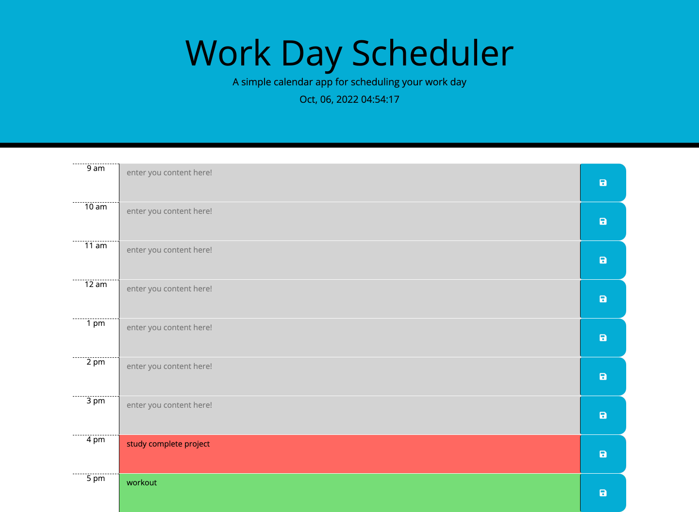

# work-day-scheduler
## Third-Party APIs: Work Day Scheduler

Created a simple calendar application that allows a user to save events for each hour of the day. This app will run in the browser and feature dynamically updated HTML and CSS powered by jQuery.

I have used [Moment.js](https://momentjs.com/) library to work with date and time. 

